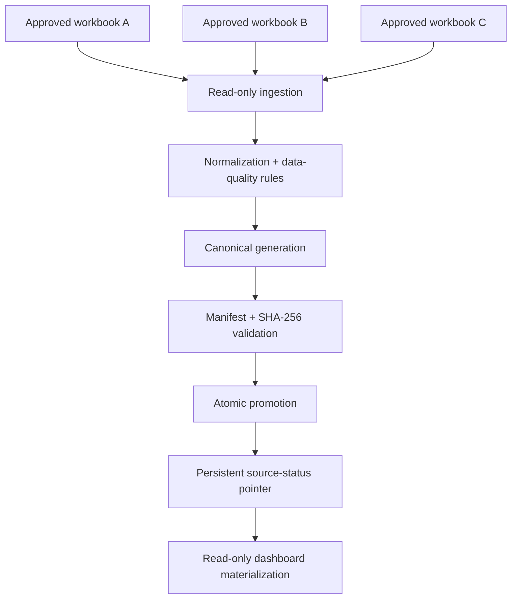

# Asset Data Integration Portfolio

A **sanitized data-integration case study** documenting the normalization, reconciliation, persistence, integrity validation, and dashboard preparation of three operational asset registers.

> **Portfolio scope:** This repository contains architecture, data-contract, quality, and runtime case-study documentation only. It does **not** contain the source workbooks, production asset records, SharePoint credentials, tenant secrets, internal URLs, or writable production integration code.

## What this project demonstrates

- reconciliation of three independently maintained operational asset registers;
- canonical data modelling without overwriting source evidence;
- data-quality auditing and rule-based normalization;
- separation of business identifiers from internal snapshot trace keys;
- immutable source snapshots using SHA-256 content identity;
- Microsoft Graph / SharePoint read-only integration design;
- exact-filename allowlisting and change detection;
- versioned canonical generations;
- atomic promotion and recovery to prior valid generations;
- persistent source-status tracking across process restarts;
- read-only dashboard preparation over verified canonical state.

## Scale and validated result

The audited source boundary contained **4,545 non-empty mapped rows**, including **4,513 operational records** and **32 AGA item-only placeholders** that were explicitly excluded from the canonical operational set.

The live persistent runtime later validated the same canonical boundary as:

- AGA: **309** records;
- AGAMal: **4,005** records;
- CLM/CSS: **199** records;
- total operational records: **4,513**;
- excluded AGA placeholders: **32**.

No duplicate was silently deleted or merged during the data-quality phase.

## Architecture

The design treats original spreadsheet values as authoritative evidence. Normalized and derived fields support search, comparison and reporting but do not replace the raw source values.

## Case-study sections

- [Data Quality & Reconciliation](docs/data-quality.md)
- [Canonical Data Contract & Identity](docs/canonical-data-contract.md)
- [Persistent State, Integrity & Recovery](docs/persistent-runtime.md)
- [Dashboard & Reporting Semantics](docs/dashboard.md)

## Identity principle

A major design decision was **not to invent durable asset identity when the source systems could not support it**.

The canonical model therefore distinguishes:

- official/business asset numbers;
- exact source evidence;
- snapshot-scoped source record keys;
- deterministic snapshot record keys;
- future durable real-world asset identity, which remained deliberately unavailable.

This prevents internal UUIDs or row positions from being misrepresented as authoritative lifecycle identity.

## Data-quality philosophy

Normalization is conservative:

- raw values are preserved;
- whitespace/case/punctuation normalization is used for comparison where appropriate;
- ambiguous identifiers are not silently promoted to official IDs;
- missing quantities are not defaulted;
- donation markers are not converted to numeric zero;
- location variants are not automatically merged when the business meaning is uncertain;
- duplicate candidates are reported, not auto-deleted.

## Runtime resilience

The persistent runtime uses immutable generation directories and an atomically replaced active pointer. Promotion occurs only after the full expected record/exclusion contract, file manifests, byte lengths and SHA-256 hashes validate.

If a promotion fails before pointer replacement, the previous generation remains active. If the pointer or latest generation becomes corrupt, startup can recover the newest older committed generation whose integrity and source boundary still validate.

## Dashboard semantics

The read-only dashboard keeps **registered asset records** separate from **known asset units** because quantity coverage is incomplete. UNKNOWN condition remains explicit rather than being treated as GOOD, and snapshot-only system identities appear only in trace detail.

## Skills demonstrated

`Python` · `Microsoft Graph` · `SharePoint` · `Data Integration` · `Data Quality` · `Canonical Data Modelling` · `SHA-256 Integrity` · `Atomic State Promotion` · `Immutable Generations` · `Reconciliation` · `Operational Dashboards` · `Git` · `Technical Documentation`

---

**Derek Asamoah-Amoyaw**  
Senior IT Infrastructure & Cloud Engineer · Microsoft Certified: Azure Administrator Associate (AZ-104)  
[GitHub Profile](https://github.com/Deberryx) · [LinkedIn](https://www.linkedin.com/in/derek-asamoah-ctfl-143650b8/)
